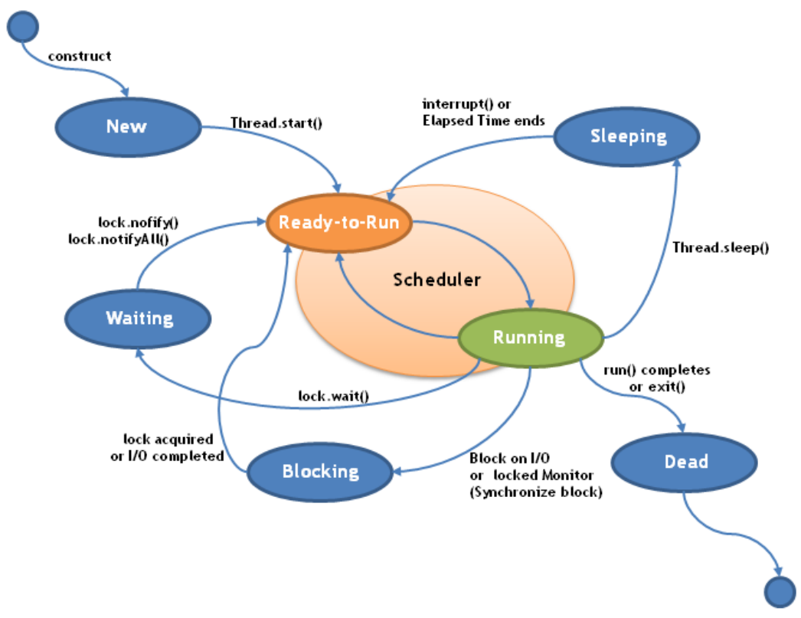

# Introduccion a la Programacion Concurrente

## El problema de la correccion del software

Poder garantizar la corrección del software que construimos es una tarea deseable. En algunas aplicaciones es sin dudas crucial (software para equipamiento médico, vehículos, control de procesos etc.). Estos sistemas cuyas fallas pueden ocasionar daños de gran importancia incluyendo pérdida de vidas humanas, catástrofes ecológicas, grandes pérdidas financieras se denominan **Sistemas Críticos**.

## Limitaciones del testing y la simulacion

Tanto el testing como la simulación involucran experimentos previos al lanzamiento o uso masivo del software. En general ambos métodos proveen una serie de entradas al software y estudian el comportamiento del mismo en esos caos. El testing y la simulación raramente permiten generalizar la usencia de errores, con lo que se pretende afirmar que **“El testing puede confirmar la presencia de errores, pero nunca garantizar su ausencia”**. Con lo que se pretende afirmar que la verificación sólo puede hacerlo en teoría.

## Verificación (semi) automática de software

Existen serias limitaciones en lo que respecta a la verificación automática de software. Sin embargo, si imponemos algunas restricciones sobre las propiedades que queremos verificar, algunas tareas podrán verificarse automáticamente sobre el sistema.

## El enfoque de modelar

Nuestros modelos representan comportamientos verdaderos de programas escritos en java. Los modelos abstractos de programas se centran en los detalles reales relacionados con la representación de datos, asignación de recursos y la interacción con el usuario. Introduciremos mecanismos para verificar que el modelo satisface condiciones particulares de seguridad y las propiedades de progreso que son requeridas por las aplicaciones.

Estos mecanismos de verificación son posibles gracias a una herramienta de modelado, con la que comprobaremos exhaustivamente el modelo utilizado, lo que permite comprobar propiedades deseables como indeseables para todas las posibles secuencias de eventos y acciones. Los modelos se basan en máquinas de estados finitos y Redes de Petri.

Las máquinas de estados finitos Se utilizan para especificar el comportamiento dinámico de los objetos en métodos bien conocidos de diseño orientado a objetos. tienen una semántica intuitiva, fáciles de entender y una representación gráfica sencilla y tienen propiedades matemáticas bien definidas, que facilitan el análisis formal y la comprobación mecánica de sistemas, evitando el tedio y la introducción de errores inherentes al trabajo manual e intelectual de los métodos formales. Hay que notar que la representación gráfica de las máquinas de estado, limita seriamente la complejidad de los problemas que se pueden abordar. Por lo que se utiliza Redes de Petri.

## Características reactivas de los sistemas concurrentes

Muchos programas concurrentes sueles ser **reactivos**, es decir su funcionamiento involucra la interacción permanente con el ambiente y otros procesos. Los **sistemas reactivos** tienen características diferentes a las de los **programas transformacionales**. En muchos casos estos no computan resultados y suelen no requerir que terminen.

## Interacción de programas concurrentes

Los programas concurrentes están compuestos por **procesos** (threads o componentes) que necesitan interactuar, existen diferentes formas de interactuar como la memoria compartida o el intercambio de mensajes. Además, los programas concurrentes deben, en general, colaborar para llegar a un objetivo común para lo cual la sincronización entre procesos es crucial.

## Problemas comunes de los programas concurrentes

- Violación de propiedades universales (**invariantes**)
- **Starvation(inanición)**: uno o más procesos quedan esperando indefinidamente un mensaje o la liberación de un recurso
- **Deadlock**: dos o más procesos esperan mutuamente el avance del otro
- Problemas de uso no exclusivo de recursos compartidos
- **Livelock**: dos o más procesos no pueden avanzar en su ejecución porque continuamente responden a los cambios en el estado de otros procesos

!!! note "ATOMICO"
    Que algo sea atomico significa que no puede ser interrupido hasta que se completa su ejecucion

## Semántica de los programas concurrentes

Una semántica típica para los programas concurrentes está basada en **sistemas de transición de estados**. Mi programa tiene **estados**, algo que demora un tiempo en estar en esa condición, y va a tener **eventos** que ocurren en el momento que me cambian el estado actual. Un sistema de transición de estados, _nos permite ver los estados posibles y que eventos me hacen cambiar de estado_, es un grafo dirigido en el cual:

- Los nodos son los estados del sistema
- Las aristas son las transiciones atómicas de estado en estado, dadas por las sentencias del sistema (líneas que unen estados)
- Hay un nodo distinguido que reconoceremos como el estado inicial.

!!! note
    Un sistema es **determinístico**, cuando estando en un estado, frente al mismo evento, va al mismo lugar siempre

## Como se ejecutan los procesos concurrentes

De acuerdo al modelo computacional descripto: **los procesos concurrentes se ejecutan intercalando las acciones atómicas que los componen, llamamos a esto interleaving**, son las combinaciones de las posibles ejecuciones o las trazas de ejecución de los hilos. El orden en que se ejecutan las acciones atómicas no puede decirse en general y un mismo par de procesos pueden tener diferentes ejecuciones debido al no determinismo en la elección de las acciones atómicas a ejecutar.

## Razonamiento sobre los programas concurrentes

Es difícil razonar sobre los programas concurrentes y garantizar que un programa concurrente es correcto también es difícil. Tiene que ver con que diferentes interleaving de acciones atómicas pueden llevar a diferentes resultados o comportamientos de los sistemas concurrentes. El número de interleaving posibles es en general muy grande lo que hace que el testing difícilmente pueda brindarnos confianza.

## Modelos de programación concurrente

Tenemos que hacer abstracción: acto mental en el que se puede aislar conceptualmente una propiedad o función concreta de un objeto y se piensa que es, ignorando otras propiedades del mismo. Manera de ocultar los detalles de implementación de ciertas funcionalidades. Una forma de aliviar el problema de razonar sobre programas concurrentes es considerar representaciones abstractas de estos. Estas representaciones llamadas modelos nos permiten centrarnos en las características particulares que queremos analizar. Para esto es importante considerar los eventos en los cuales cada proceso puede estar involucrado y los patrones de concurrencia.

## Proceso

Formalmente un proceso es: **unidad de actividad que se caracteriza por la ejecución de una secuencia de instrucciones, un estado actual y un conjunto de recursos del sistema asociado**. El que administra los procesos, sus estados y los recursos es el **sistema operativo**, proporciona los servicios necesarios para que el usuario pueda ejecutar procesos. Al comienzo de las ejecuciones del programa se inicia la ejecución de un proceso, este proceso podría crear nuevos procesos (proceso padre, proceso hijo). Una vez creado un proceso hijo, la ejecución de padre e hijo transcurren de manera concurrente.

**Un proceso es un programa en ejecución**. Un proceso simple tiene al menos un hilo de ejecución. Diferencia entre programa y procesos: un proceso es una actividad de cierto tipo que contiene: programa, I/O y estados. Procesos cooperantes: se entiende que los procesos interactúan entre sí. Procesos independientes: no requieren información de otros

## Estados de un proceso

Clasificación en 3 estados

- **Listo**: son los que pueden pasar a estado de ejecución
- **En ejecución**: son los que se están ejecutando en el procesador
- **Bloqueado**: están esperando la respuesta de algún otro proceso para poder continuar con su ejecución

Clasificación en 5 estados

- **Activo**: está ejecutándose
- **Preparado**: todas las tareas están listas para ejecutarse, pero se espera a que un/el procesador quede libre (hay otros procesos más prioritarios en ejecución)
- **Bloqueado o suspendido**: que se termine una operación de E/S o que se reciba una señal de sincronización
- **Nonato**: indica que el programa realmente existe, pero todavía no es conocido por el OS
- **Muerto**: cuando ha terminado su ejecución o el sistema operativo ha detectado un error fatal

## Estados

Son aquellos que compiten con el procesador o están en condiciones de hacerlo. Se dividen en

- **Activos**
  - _Ejecución_: Estado en el que se encuentra un proceso cuando tiene el control del procesador. En un sistema monoprocesador este estado sólo lo puede tener un proceso.
  - _Preparado_: Aquellos procesos que están dispuestos para ser ejecutados, pero no están en ejecución por alguna causa (Interrupción, haber entrado en cola estando otro proceso en ejecución, etc.).
  - _Bloqueado_: Son los procesos que no pueden ejecutarse de momento por necesitar algún recurso no disponible (generalmente recursos de entrada/salida).
- **Inactivos**:
  - _Suspendido bloqueado_: Es el proceso que fue suspendido en espera de un evento, sin que hayan desaparecido las causas de su bloqueo
  - _Suspendido programado_: Es el proceso que han sido suspendido, pero no tiene causa parta estar bloqueado.

## Hilos

Permiten a una aplicación realizar varias tareas a la vez. Los distintos hilos de ejecución comparten recursos: el espacio de memoria, los archivos abiertos, etc. Esta técnica simplificada permite llevar a cabo distintas funciones simultáneamente. Los hilos de ejecución que comparten los mismos recursos y estados recursos, son en conjunto conocidos como un proceso.

Si un mismo proceso comparte los recursos, hace que cualquiera de sus hilos pueda modificarlos. Cuando un hilo modifica un dato en la memoria, los otros hilos acceden a ese dato modificado inmediatamente. Lo que es propio de cada hilo es el contador de programa, la pila de ejecución y el estado de la CPU (incluyendo el valor de los registros). El proceso sigue en ejecución mientras al menos uno de sus hilos de ejecución siga activo.

## Diferencias entre hilos y procesos

Los procesos son independientes, llevan bastante información de estados, e interactúan sólo a través de mecanismos de comunicación dados por el sistema. Los hilos generalmente comparten otros recursos de forma directa. Es más simple y rápido cambiar de un hilo a otro dentro del mismo proceso, que cambiar de un proceso a otro. Este fenómeno se debe a que los hilos comparten datos y espacios de direcciones, mientras que los procesos, al ser independientes, no lo hacen.

Un proceso es un programa en ejecución con su propio espacio de memoria y recursos aislados, mientras que un hilo (o subproceso) es una unidad de ejecución más ligera que existe dentro de un proceso y comparte su memoria y recursos, permitiendo una comunicación más rápida y una ejecución concurrente de tareas dentro de la misma aplicación, lo que mejora el rendimiento.

## Ventajas de los hilos

1. Se tarda menos tiempo en crear un hilo nuevo en un proceso existente que crear un nuevo proceso
2. Se tarda menos en terminar un hilo que un proceso
3. Se tarda menos en cambiar entre dos hilos de un mismo proceso.

Los hilos aumentan la eficiencia de la comunicación entre programas en ejecución. La comunicación entre procesos debe intervenir el núcleo para ofrecer protección de los recursos y realizar la comunicación misma. La comunicación entre hilos no requiere la invocación al núcleo. Por lo tanto, si hay una aplicación que debe implementarse como un conjunto de unidades de ejecución relacionadas, es más eficiente hacerlo con una colección de hilos que con una colección de procesos separados. Cuando un hilo está en ejecución, posee el acceso a todos los recursos que tiene asignados la tarea.

## Que tiene un hilo

- Estado
- Contexto del procesador: punto en el que estamos ejecutando. Se usa para reanudar un hilo que fue interrumpido
- Pila de ejecución donde ira metiendo y sacando instrucciones
- Espacio de almacenamiento estático donde almacenara las variables
- Acceso a los recursos de la tarea que son compartidos por todos los hilos de la tarea

## Concurrencia

Exclusión Mutua y sincronización: Estos conceptos se van a dar en distintas plataformas:

- **Multiprogramación**: consiste en la gestión de varios procesos dentro de un sistema monoprocesador
- **Multiprocesamiento**: consiste en la gestión de varios procesos dentro de un sistema multiprocesador
- **Procesamiento distribuido**: consiste en la gestión de varios procesos ejecutándose en sistemas de computadoras múltiples y distribuidos.

La concurrencia es fundamental en todas estas áreas y para el diseño. Comprende un gran número de cuestiones de diseño como: comunicación entre proceso, compartición y competencia por los recursos, sincronización de la ejecución de varios procesos, asignación de tiempo. La concurrencia puede presentare en tres contextos diferentes: Multiplicaciones, aplicaciones estructuradas, estructura del sistema operativo.

## Principios Generales de la concurrencia

Multiprogramado con un único procesador, los procesos se intercalan en el tiempo aparentando una ejecución simultánea. Los problemas son consecuencia de la velocidad de ejecución de los procesos que no pueden predecirse y depende de las actividades de otros procesos de la forma en que el sistema operativo trata las interrupciones surgen dificultades
Compartir recursos globales es riesgoso, esto ocasiona problemas por esto necesitamos proteger a dichos recursos. Los procesos interactúan entre ellos según el nivel de conocimiento que cada proceso tiene de la existencia de los demás. Existen 3 niveles de conocimiento

1. Los procesos no tienen conocimiento de los demás
2. Los procesos tienen conocimiento indirecto de los demás: No conocen a los otros por sus identificadores per muestran cooperación
3. Los procesos se conocen directamente: se comunican por el identificador y por trabajar en conjunto

Los procesos concurrentes entran en conflicto cuando compiten por el uso del mismo recurso. La ejecución de un proceso puede influir en el comportamiento de los procesos que compiten. Cuando hay procesos en competencia, se debe solucionar 3 problemas de control:

- La necesidad de **exclusión mutua**
- Hacer que se cumpla la exclusión mutua genera un interbloqueo
- La **inanición**, no se recibe un recurso en el tiempo que se necesita

## Requisitos para la exclusión mutua

Solo un proceso de todos los que poseen secciones criticas (partes del código que varios procesos quieren ejecutar a la vez) por el mismo recurso compartido debe tener permiso para entrar en ella en un momento dado. Un proceso que se interrumpe en una sección no critica debe hacerlo sin interferir a los demás. Deben poder solicitar acceso a una sección critica para luego ser demorado indefinidamente. Si ningún proceso está en su sección critica, cualquier otro proceso que solicite acceso a su sección critica debe hacerlo sin demoras. Un proceso permanece en su sección critica por tiempo finito

## Sincronización

La comunicación entre procesos implica sincronización. El receptor no puede recibir un mensaje hasta que sea enviado por otro proceso. Además, hace falta especificar que le sucede a un proceso después de ejecutar una primitiva SEND o RECEIVE. Cuando se ejecuta una primitiva SEND en un proceso hay 2 posibilidades: el proceso emisor se bloque hasta que recibe el mensaje o no se bloquea
Cuando se ejecuta una primitiva RECEIVE existen 2 opciones: si previamente se ha enviado algún mensaje este es recibido y continua la ejecución. Si no hay mensaje esperando entonces el proceso se bloquea esperando o continúa abandonando el intento de recepción. El emisor y el receptor pueden ser bloqueantes o no bloqueantes. Existen 3 tipos de combinaciones (solo se implementan 1 o 2)

1. **Envió y recepciones bloqueantes**: ambos se bloquean hasta que llegue el mensaje (rendezvous)
2. **Envió no bloqueante, recepción bloqueante**: el emisor continuo, el receptor se bloquea hasta que legue el mensaje. Es la opción más utilizada y natural
3. **Envió y recepción no bloqueante**: nadie se espera.

## Programación

- **Concurrente**: un sistema concurrente es aquel en el que un conjunto de cómputos avanza colaborativamente para lo cual está garantizada y coordinada la secuencia de las interacciones o comunicaciones entre diferentes cómputos como también el acceso a los recursos que se comparten.
- **Paralela**: forma de cómputo en la que muchas instrucciones se ejecutan simultáneamente dividiendo el problema en tareas más pequeñas que se resuelven en simultaneo

---
