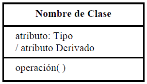

# Apuntes Practicos

## Indice

1. [Modelado de un sistema con Diagramas UML](#modelado-de-un-sistema-con-diagramas-uml)

---

## Modelado de un sistema con Diagramas UML

### Introduccion UML

**UML: lenguaje unificado de modelado**. Es un lenguaje gráfico para modelar, visualizar, especificar, construir y documentar un sistema de software. Es importante remarcar que UML es un "lenguaje de modelado" para especificar o para describir métodos o procesos. Se utiliza para definir un sistema, para detallar las partes del mismo y para documentar y construirlo. En otras palabras, es el lenguaje en el que está descripto el modelo del sistema. UML cuenta con varios tipos de diagramas, los cuales muestran diferentes aspectos/vistas de las entidades representadas del sistema.

### Tipos de Diagramas

- **Estructurales**: Muestran la estructura estática de los objetos en un sistema por ej. Diagrama de Clases, de componentes, de despliegue, de objetos, de paquetes, de perfiles de estructura compuesta.
  – **De Interacción y Comportamiento**: Muestran el comportamiento dinámico de los objetos en el sistema por ej: Diagrama de Secuencia, de Actividades, Casos de Uso, global de interacciones, de comunicación, de tiempos.

### Diagrama de Clases

Permite visualizar las relaciones entre las clases del sistema. Los diagramas de clases son el tipo de diagrama UML de estructura estática más utilizado. Es el bloque de construcción principal de cualquier solución orientada a objetos. En un diagrama de clases se muestra

- Las clases del sistema.
- Nombre y atributos de cada clase.
- Operaciones de cada clase.
- Relación entre cada clase.

En la mayoría de las herramientas de modelado, una clase tiene tres partes, nombre en la parte superior, atributos en el centro y operaciones o métodos en la parte inferior.

En sistemas grandes con muchas clases relacionadas, las clases se agrupan. Las Diferentes relaciones entre las clases se muestran por diferentes tipos de flechas.

En los diagramas de clase se puede describir la visibilidad de los miembros de la clase (atributo o método).

- **Public**: el miembro es visible dentro y fuera de la clase. **+**
- **Private**: el miembro es accesible solo desde adentro de la clase. **-**
- **Protected**: el miembro no será accesible desde fuera de la clase, pero si podrá ser accesado por métodos de la clase además de las subclases que se deriven (herencia). **#**

### Diagrama de Secuencia

Los Diagramas de Secuencias muestran la forma en que un grupo de objetos se comunican (interactúan) entre sí a lo largo del tiempo.Permite modelar cómo los objetos interactúan y el orden en que se producen esas interacciones. Se debe modelar la interacción de los objetos del sistema para cada caso de uso.

Un Diagrama de secuencia consta de objetos, mensajes entre estos objetos y una línea de vida del objeto representada por una línea vertical. El tiempo transcurre de arriba hacia abajo.

[Mas Informacion sobre Diagramas UML](../fuentes/Filminas%20Diagramas%20UML%202025.pdf)

---
